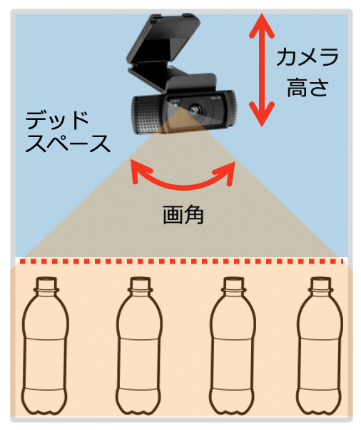

# 部品リスト

## ソフトウェア
今回デバイス側で利用するソフトウェアの一覧を以下にまとめます。

1. [AWS IoT Greengrass][gg-platforms]をインストールすることのできるRaspbian OS
1. Python
1. [AWS IoT Greengrass][gg]

## ハードウェア
|No.   | 部品イメージ	| 物品名	| 用途	| 概算単価	|必要個数	|小計	|購入先と商品ページ	|商品選定における考慮事項	|
| ---: | :---:	| :---:	| :---:	| ---:	| ---:	| ---:	| :---:	| :---:	|
|1	|	|冷蔵庫	|商品棚	|¥48,000	|1	|¥48,000	|[Amazon.co.jp](https://www.amazon.co.jp/dp/B07WVTSWBS/ref=psdc_2353804051_t3_B07WVR7X2W)	|[冷蔵庫](###冷蔵庫)	|
|2	|	|Raspberry Pi セット	|デバイス制御	|¥13,000	|1	|¥13,000	|[Amazon.co.jp](https://www.amazon.co.jp/dp/B082VVJCPT/ref=cm_sw_em_r_mt_dp_U_r6z4Eb01GRDE4)	|	|
|3	|	|USBカメラ	|商品認識	|¥3,000	|2	|¥6,000	|[Amazon.co.jp](https://www.amazon.co.jp/dp/B01LXYHF71/ref=dp_cerb_1)	|[カメラ](###カメラ)	|
|4	|	|QRコードリーダー	|QRコードの読み込み	|¥7,000	|1	|¥7,000	|[Amazon.co.jp](https://www.amazon.co.jp/dp/B07634BV2W/ref=cm_sw_em_r_mt_dp_U_GGd.EbAT63B8B)	| |
|5	|	|庫内照明	|商品認識	|¥2,000	|4	|¥8,000	|[Amazon.co.jp](https://www.amazon.co.jp/dp/B07NP9SBQ2/ref=cm_sw_em_r_mt_dp_U_WQd.Eb8DKDM65)	|黄色ではなく白色が望ましい。段の数x2を用意	|
|6	|	|電磁ロック	|ドアの開錠・施錠	|¥2,000	|1	|¥2,000	|[Amazon.co.jp](https://www.amazon.co.jp/gp/product/B072JJZTCF/ref=ppx_yo_dt_b_asin_title_o04_s04?ie=UTF8&psc=1)	|	|
|7	|	|DC電源	|照明とドアロックの電源	|¥3,000	|1	|¥3,000	|[Amazon.co.jp](https://www.amazon.co.jp/dp/B07L3N37QG/ref=cm_sw_em_r_mt_dp_U_KtA4EbHH97CVV)	|電圧は12V、電流値は8A推奨	|
|8	|	|機械式リレー	|ドアロック制御	|¥1,000	|1	|¥1,000	|[Amazon.co.jp](https://www.amazon.co.jp/dp/B00JGFF0QO/ref=cm_sw_em_r_mt_dp_U_lcA4EbZMBGD3K)	|	|
|9	|	|磁気センサ	|ドアの開閉検出	|¥1,000	|1	|¥1,000	|[Amazon.co.jp](https://www.amazon.co.jp/dp/B07FLWGS73/ref=cm_sw_em_r_mt_dp_U_8iA4Eb417EY06)	|	|
|10	|	|板	|複数段のための仕切り	|¥3,000	|1	|¥3,000	|[はざいや](https://www.hazaiya.co.jp/estimate/board_simple.php)	|厚さ: 5mm x 幅: 408mm x 奥行き: 320mm	|
|11	|	|強力両面テープ	|部品設置と固定	|¥500	|2	|¥1,000	|[Amazon.co.jp](https://www.amazon.co.jp/gp/product/B003CYDLS4/ref=ppx_yo_dt_b_asin_title_o08_s00?ie=UTF8&psc=1)	|	|
|12	|	|ビニールテープ	|配線固定	|¥100	|1	|¥100	|[Amazon.co.jp](https://www.amazon.co.jp/dp/B004JM5SOS/ref=cm_sw_em_r_mt_dp_U_5CA4Eb7PQVD5Q)	|白	|
|13	|	|配線付きコネクタ	|配線作成	|¥1,000	|2	|¥2,000	|[Amazon.co.jp](https://www.amazon.co.jp/dp/B07W5SBYMQ/ref=cm_sw_em_r_mt_dp_U_UQA4Eb736J34B)	|	|
|14	|	|コネクタ	|配線作成	|¥1,000	|2	|¥2,000	|[Amazon.co.jp](https://www.amazon.co.jp/dp/B01MD283AC/ref=cm_sw_em_r_mt_dp_U_mEA4EbR43DM9X)	|	|
|15	|	|圧着工具	|コンタクト圧着	|¥3,500	|1	|¥3,500	|[Amazon.co.jp](https://www.amazon.co.jp/dp/B002AVVO7U/ref=cm_sw_em_r_mt_dp_U_iTA4EbE9RSENX)	|	|
|16	|	|配線材	|電気配線	|¥500	|2	|¥1,000	|[Amazon.co.jp](https://www.amazon.co.jp/gp/product/B010SBSX4K/ref=ppx_yo_dt_b_asin_title_o01_s00?ie=UTF8&psc=1)	|	|
|17	|	|ワイヤーストリッパー	|配線材の被覆剥き	|¥1,000	|1	|¥1,000	|[Amazon.co.jp](https://www.amazon.co.jp/dp/B087BXPP6K/ref=cm_sw_em_r_mt_dp_U_bKA4Eb2XF6P2V)	|	|
|18	|	|圧着スリーブ	|配線結合	|¥500	|2	|¥1,000	|[Amazon.co.jp](https://www.amazon.co.jp/dp/B002A5RM2M/ref=cm_sw_em_r_mt_dp_U_JNA4EbSB7A3MF)	|より線断面積: 0.3~1.65	|
|19	|	|ペンチ	|圧着スリーブの圧着	|¥500	|1	|¥500	|[Amazon.co.jp](https://www.amazon.co.jp/dp/B006JZIEMQ/ref=cm_sw_em_r_mt_dp_U_rjC4Eb9KTVVB3)	|ラジオペンチではないもの	|
|20	|	|半田と半田ごて	|照明用配線の半田付け	|¥1,000	|1	|¥1,000	|[Amazon.co.jp](https://www.amazon.co.jp/dp/B07R9YV4DZ/ref=cm_sw_em_r_mt_dp_U_UxT4EbKDB3HQ9)	|数カ所しか半田付けしないため、少量で良い	|
|21	|	|グルーガン	|照明配線の絶縁	|¥2,000	|1	|¥2,000	|[Amazon.co.jp](https://www.amazon.co.jp/dp/B07PT9NG23/ref=cm_sw_em_r_mt_dp_U_eIA4EbXP3B73Z)	|	|
|22	|	|デジタルマルチメータ	|電気回路のデバック作業	|¥1,000	|1	|¥1,000	|[Amazon.co.jp](https://www.amazon.co.jp/dp/B003272E48/ref=cm_sw_em_r_mt_dp_U_qvT4Eb26PBN30)	|導通確認機能があるものが望ましい	|
|23	|	|プラスドライバー	|多用途	|¥1,000	|1	|¥1,000	|[Amazon.co.jp](https://www.amazon.co.jp/dp/B0016VCJLU/ref=cm_sw_em_r_mt_dp_U_ilC4Eb471C7KT)	|	|
|24	|	|対象商品	|今回物体認識の対象となる商品	|	|	|¥0	|	|[対象商品](###対象商品)	|
|	|	|	|	|	|概算金額	|¥109,100	|	|	|

## 冷蔵庫やカメラ、対象商品選定に関する考慮事項
これらの商品の選定にあたっては、冷蔵庫、カメラ、対象商品の組み合わせを総合的に考慮する必要があります。

今回はカメラ画像から物体検出を行うことで商品を特定する手法を採用しています。
そのため、商品を検出できる箇所がカメラの画角内に収まっている必要があります。
天井から商品上面を撮影して検出しようとすると、カメラ画角内に冷蔵庫平面内の商品が全て写るようセットしなければなりません。
リスト記載の冷蔵庫ですと2段にした場合、画角120度という広角なカメラを使っても、両脇や端に設置した500mlペットボトルのキャップ部分のラベルを写すことはできません。
1段ならば写りますし、もっと背の低い商品のみに制限すれば複数段も実現可能です。

先述したように、これらの要素は総合的に考慮する必要がありますが、以下に個別の選定基準を示します。

### 冷蔵庫
冷蔵庫を選ぶあたって、望ましい、望ましくない、項目について以下にまとめます。

#### 望ましいもの
庫内内装が白などの薄い色。
理由は光が反射しやすいため明るく、商品がはっきりととらえやすくなるためです。

#### 望ましくないもの
1. 庫内内装が黒などの濃い色。
理由は暗くなってしまい、商品が見えづらくなってしまうためです。
何らかの手段を用いて自身で中を白くすることで解決は可能です。
しかしながら余計な作業が発生するのと、見た目の観点からオススメしません。
1. 4方がガラスのショーケース
理由は、外光が大量に入ってしまい、撮影環境が安定しないためです。
結果として推論の精度が落ちる可能性があります。
こちらもガラスを覆うことで解決は可能かと考えます。
1. 断面の大きなもの。
理由については、容量は上がりますが、その分カバーしなければならない範囲が増えますので、よりカメラと商品との間に距離を設ける必要があるためです。
こちらに関しては、一つの段においても左右に分ける仕切りを設けてそれぞれにカメラを設置することで解決することは可能だとは思います。

### カメラ
庫内のデッドスペースを可能な限り少なくする、底面積の広い冷蔵庫を使用する場合、広角なカメラを設置することが一つの選択肢となります。
一方で広角なカメラは、特に画像の辺付近で大きな歪みを発生させます。
そのためあまりに広角なカメラを使用すると、冷蔵庫の端や角に置いた商品の上面ラベルが大きく歪み、その結果商品の認識と検出に影響を及ぼします。
庫内の端や角に置いた商品画像を撮影し、歪んだ画像を学習データに含めることで、このような条件の商品を認識させることができると考えていますが、考慮点が増えることになります。
これらの考慮し、カメラを選定してください。

[gg]: https://docs.aws.amazon.com/greengrass/latest/developerguide
[gg-platforms]: https://docs.aws.amazon.com/greengrass/latest/developerguide/what-is-gg.html#gg-platforms