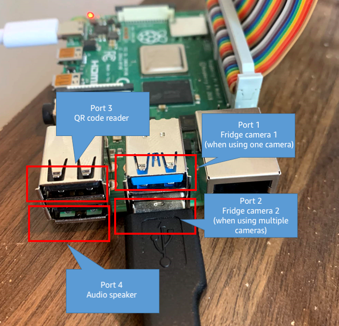

# Smart Cooler - Building procedure

## Purpose of this procedure
By following these steps, it is possible to comprehensively learn the IoT and AI/ML based solution. The main purpose of this procedure is to enable customers to build their own cashless vending fridge, which will lead to the improvement of their "do-it-yourself" skills.
As a result, it is assumed that the customer will customize the cashless vending fridge and operate it in a real business context by utilizing the skills acquired in this procedure.

## What are we building?
A cashless vending refrigerator (hereinafter referred to as Smart Cooler) is a purchase experience that does not require payment by recognizing drinks and foods taken out by consumers and completing payment by using IoT and AI/ML technology.

---
## Building steps
The procedure for building the Smart Cooler is roughly divided into the following steps.

### [1. Hardware assembly](#1-hardware-assembly)

### [2. Raspberry Pi setup](#2-raspberry-pi-setup)

### [3. Device settings](#3-device-settings)

### [4. Device certificate and private key](#4-device-certificate-and-private-key)

### [5. Middleware settings](#5-middleware-settings)

### [6. AWS Service Settings](#6-aws-service-settings)

### [7. Object detection model creation (optional)](#7-object-detection-model-creation-optional)

### [8. CI/CD pipeline (optional)](#8-cicd-pipeline-optional)


---
## 1. Hardware assembly
### Parts selection and procurement
The components are summarized in [here](BOM.en.md).
Please purchase in advance what you do not have from this list.

### Installation of shelf divider
If you are considering building the fridge with two shelves, insert the divider as described here.
1. Remove all the dividers that came with the fridge.
1. Insert the divider you purchased into the middle of the refrigerator and check that it is the correct size.


### Camera installation
Next, let's install the camera for product recognition inside the refrigerator.


#### Selecting a camera
For the selection and mounting position of the camera, refer to the camera item in [here](BOM.md).
This fridge requires a camera for each shelf, so the number of cameras to purchase and install is the same as the number of shelves to prepare.

#### Removing the body cover


To keep the camera height as low as possible, disassemble the camera and remove the main unit cover if necessary.
By doing this, you may be able to reduce the height of the camera by the amount of the body cover size.
If you remove the cover, protect the camera board with masking tape as needed.


#### Wiring to the fridge
The connection destination of the USB cable from the camera is the Raspberry Pi.
It is recommended to hide the Raspberry Pi and the relay module in the space behind the fridge.
Therefore, since the camera body is inside the fridge, the USB cable needs to be routed out of the fridge and connected to the Raspberry Pi to be installed on its back.

Pass the camera USB cable through the hole in the fridge and pull out the terminal.
There should be a hole on the back of the fridge for draining melted frost water.
Use this hole to pass the camera cable.
However, since this hole is not large, the USB A type terminal cannot be passed through as it is.
Therefore, temporarily remove the connector connected to the camera board and pass the connector through this hole.
Since the connector on the camera body side is often small, it may be possible to pass it through the hole by turning it vertically.
If it is difficult, consider another wiring method, such as making a hole in the refrigerator body so as not to lose the function of the refrigerator, or wiring from the door side.


If you've successfully routed the cable through the hole, replug the connector and make sure the camera is working properly.


#### Attaching the camera
Next, we will attach the camera to the inside of the fridge.
1. Stick double-sided tape on the camera.
You can use double-sided tape to attach the camera, or some type of glue.
1. Install the camera on the ceiling of each shelf with double-sided tape.
<br>The cameras will photograph the top side of the products inside the fridge and each product will be identified by its label and visual features.
Therefore, mount each camera on the ceiling of each shelf.
When installing the camera, it is necessary to attach it at a position so that all products on the shelf can be captured by the camera.
It is recommended to place products on the corners or edges of each shelf, connect the camera to a PC, etc., and attach it while checking the camera image.
Make fine adjustments while checking the image to confirm the camera position.


### Lighting installation
Like the camera, the light panels will be installed on the ceiling of each shelf.
Here, it is assumed that two light panels will be installed for each shelf.
When using computer vision technology like this time, the lighting environment is one of the very important factors.
If the light is too strong (causing excessive glare on the top of the products), make adjustments to the lighting environment, such as reducing the number of panels or installing diffusers if necessary.

#### Assembling power cables for the light panels


Since there is only one DC power adapter and we will use multiple light panels, it is necessary to split the power supply cable to feed multiple lights.
Therefore, assemble the split power supply cables as shown in the pictures above.
We will create 4 sets of this split cables.

1. First, prepare the parts and tools to be used.
The cables used have male and female connector plugs.
A crimp sleeve is also used to connect these.
Use pliers to crush and crimp the crimp sleeve.
1. Arrange the parts prepared above as shown in the picture above.
Create a cable that splits the female side into two connectors and keep the male side with one connector.
1. Next, connect the wires of the same color using a crimp sleeve.
Insert one wire on one side of the crimp sleeve and two wires on the other side to crimp.
The crimp sleeve is connected by contacting the metal cylinder inside and the wires on both sides.
Therefore, when the sleeve is crushed, if the insulated part of the wire is brought into contact with the metal cylinder inside the sleeve and crimped, the connection cannot be made and the power cannot be supplied.
Thus, crimp the wire so that it is firmly in contact with the metal inside the sleeve.
To crimp it, crush the sleeve with pliers or a special tool.
After crimping, check that the wires are firmly connected by pulling them gently.
If the wires come off, crimping was not enough, so crush it further or replace it with a new sleeve and crimp it again.
1. After crimping, check the energization to see if the cable works.
As a confirmation method, use the energization function of a digital multimeter to confirm.
For how to use the energizing function, check the instruction manual of the multimeter.
1. Repeat these steps to create four branch wires.

#### Installing cables
The light panels on the list do not have power cables attached.
To do this, first attach the power supply wiring to the lighting.


1. Solder the power supply cable to the light panel.
Prepare a cable with a male connector, and solder the red wire to the (+) terminal of the light panel and the black wire to the (-) terminal.
Since this light panel is made of LEDs, it will not turn on if the polarity is incorrect.
Let's solder while paying attention to the polarity.
After soldering, pull the wires gently and make sure they are well attached with the solder.
1. Insulate the solder part with glue.
Since the soldered part and the lighting electrode part are exposed, insulate them using hot glue.
Insert the glue stick into the hot glue gun, turn on the gun, and keep it warm.
When the gun has warmed up enough to melt the glue, apply the hot glue to the soldered area. Make sure to apply enough glue to properly insulate the solder and fixate the wires.
1. Once the cable is attached, check if it works.
Since a male connector is now attached to the light panel, prepare a cable with a female connector, and connect it to a DC power adapter.
The lights should turn on if they are at the correct polarity and are properly soldered.
If you want to test all the light panels, instead of one, use the split cable created in the previous section.
To connect four lights, you can use three split cables and split from one cable to two more cables to provide four power supplies.
By connecting the male connector of each light panel to these four female connectors, four lights can be connected in parallel and can be turned on at the same time.
If the lights do not turn on, check the power adapter, the polarity of the installed cables, and the soldering points.


#### Attaching light panels
After confirming the operation, attach the light panels to the ceiling of each shelf.
Use double-sided tape, following the same procedure as the camera.
Install the light panels so that the cables come out towards the back of the fridge.


### Electromagnetic lock installation
#### Installing the connector
Two wires (red and black) for power supply should be attached to the electromagnetic lock body.
Attach one connector to this wire.
Prepare the purchased male connector and the contact for the male connector.
Check previous steps for how to crimp the wire and how to insert it into the connector.

#### Operation check
Once you have installed the connector, check if the lock works before installing it in the fridge.
First, prepare a power supply with a female connector, and then connect the lock and power supply as it is.
At this time, if the iron plate attached to the lock and the lock body are attracted by magnetic force, it is operating normally.
Depending on the position, it may not be attracted well, so check the position where the iron plate is firmly attached.

#### Connecting to the relay module
Next, let's connect the electromagnetic lock to the relay module and check if it works.
Multiple relays may be installed on the relay module, but since the target to be controlled this time is only one electromagnetic lock, only one relay is used.
1. Before connecting, get the wires for the connection.
Prepare one red and one black wire. 
Prepare the wires with a length of about 2m (6ft), for they will be routed out through the hole in the fridge and connected to the relay module on the outside.
Attach the female connector to these two wires.
Once you have created the wires, connect them to the lock, matching the male and female connector colors.
1. Next, connect the lock to the relay.
The connection method is to first strip the wire insulation using a wire stripper and then to connect it to the relay.
Use a screwdriver to loosen the terminal screw, insert the stripped wire, and tighten the screw to connect the wire to the terminal.
At this time, make sure that the terminals cannot be easily pulled out with some tension.
There is no particular combination of terminals and wires to be connected at this time.
1. Once the lock and relay are connected, check the control of the lock using the relay.
Connect the power supply and signal line to the relay module.
For the signal line to be connected, check the characters printed on each pin of the board.
Once the connection is complete, you should be able to control the lock by inputting a signal to the relay module and the relay will click.
If the relay does not work, the power supply and signal line connection may be incorrect, so check them.


#### Installing in the  fridge
Attach the lock to the fridge using strong double-sided tape as shown in the photo below.


Also, attach the metal plate with double-sided tape at the position shown in the photo on the glass surface inside the fridge door.


Check if the lock and the metal plate make contact when the door is closed. 
Insert a spacer plate between the metal plate and the glass surface if needed to adjust the height.
Additionally, make sure that the lock and the metal plate are aligned, otherwise they may not be attracted well.
To test it, energize the lock and check if the door is strongly locked.

### Magnetic sensor installation
In the same way, attach the magnetic sensor to the fridge.

#### Operation check
First, check the operation of the sensor.
When this sensor detects magnetic force, such as when the sensor comes into contact with a magnet, its wire circuit is closed.
Check the operation of the sensor by connecting both wires to the multimeter and checking its energization by repeatedly touching and separating the sensor from the magnet.

#### Attaching the connector to the sensor
There should be two wires extending from the sensor.
Attach male connectors to the wires.

#### Creating wiring for sensors
Prepare two white wires from the purchased wiring materials.
Prepare the wires with a length of about 2m (6ft), for they will be routed out through the hole in the fridge and connected to the Raspberry Pi on the outside.
Attach a female connector to these wires.

#### Installing in the fridge
First, attach the magnetic sensor body to the place shown in the photo with double-sided tape.


Also, attach the magnet at the position shown in the picture below.


It must be installed so that the sensor body and magnet come into contact when the door is closed.
It is recommended to check the operation when installing.


### Raspberry Pi Connections
#### USB interface
Connect the following devices to the USB ports on your Raspberry Pi.

1. 2 cameras
1. Speaker
1. QR code reader

#### GPIO pin
For the devices below, connect the wiring to the GPIO pins on the Raspberry Pi.

1. Magnetic sensor (in no particular order)
    1. Connect one of the sensor wires to the GND pin on the Raspberry Pi
    1. Connect the other sensor wire to the GPIO 18 pin of the Raspberry Pi
1. Relay
    1. Connect the VCC of the relay module to the 5V pin of the Raspberry Pi
    1. Connect the GND of the relay module to the GND pin of the Raspberry Pi
    1. Connect the IN1 of the relay module to GPIO 23 pin of the Raspberry Pi


## 2. Raspberry Pi setup

1. Download the Raspberry Pi Imager and the OS image from the Raspeberry Pi site (https://www.raspberrypi.org/downloads/).
<br>For the image, select **Raspberry Pi OS (32-bit) with desktop and recommended software (Image with desktop and recommended software based on Debian Buster)**, Version: "May 2020"
2. Use the Raspberry Pi Imager to burn the image file to the SD card.
3. Insert the SD card into the Raspberry Pi and turn on the power.

---
## 3. Device settings
1. Connect a device (USB camera, USB speaker) to the USB port
Execute the lsusb command and confirm that the terminal recognizes the device. Make sure the USB camera (`Logitech, Inc. Webcam C270`) is recognized.
    ```
    pi@raspberrypi:/dev/v4l/by-path $ lsusb 
    Bus 001 Device 007: ID 0d8c:0014 C-Media Electronics, Inc. Audio Adapter (Unitek Y-247A)
    Bus 001 Device 004: ID 046d:0825 Logitech, Inc. Webcam C270
    Bus 001 Device 003: ID 0424:ec00 Standard Microsystems Corp. SMSC9512/9514 Fast Ethernet Adapter
    Bus 001 Device 002: ID 0424:9514 Standard Microsystems Corp. SMC9514 Hub
    Bus 001 Device 001: ID 1d6b:0002 Linux Foundation 2.0 root hub
    ```

1. Check which port the device (USB camera, USB speaker) is using
    1. Check `/dev/v4l/by-path` to see which USB port your device is connected to. When you plug in the USB, a symbolic link that maps the device file to the USB port is automatically created in `/dev/v4l/by-path/`.

    2. If the camera is connected to USB port 2, it will appear as follows.
    <br><code>platform-3f980000.usb-usb-0:1.<font color="Red">2</font>:1.0-video-index0</code> (* <font color="Red"> red </font> Location indicates USB port number)
    The camera connected to USB port 2 uses the device files `/dev/video0` and `/dev/video1`. 
    3. **Check the port number assigned to the USB port of the terminal from the <font color = "Red">symbolic link.</font>**
        1. The device file is reassigned when the device is restarted or when the USB device is plugged in or unplugged.
        2. You can explicitly specify a symbolic link that maps the USB port to the device file.
        3. Another method is using `udev`, but since the USB camera is used multiple times, it is mapped to the device file for each port.

            ```
            pi@raspberrypi:/dev/v4l/by-path $ ls -la
            total 0
            drwxr-xr-x 2 root root 100 Jun  8 21:04 .
            drwxr-xr-x 4 root root  80 Jun  8 20:57 ..
            lrwxrwxrwx 1 root root  12 Jun  8 20:57 platform-3f980000.usb-usb-0:1.2:1.0-video-index0 -> ../../video0
            lrwxrwxrwx 1 root root  12 Jun  8 20:57 platform-3f980000.usb-usb-0:1.2:1.0-video-index1 -> ../../video1
            lrwxrwxrwx 1 root root  13 Jun  8 20:57 platform-bcm2835-codec-video-index0 -> ../../video10
            ```
            

1. Make sure that symbolic link creation that maps USB ports to device files is performed at boot time. Write the following command in `/etc/rc.local`. (Create a symbolic link name according to the user's own environment)
   1. Mapping of port 1 and device file (for camera on the first fridge shelf)
   2. Mapping of port 2 and device file (for camera on the second fridge shelf)
   3. Mapping of port 3 and device file (QR code reader)
        ```
        root@raspberrypi:/dev# cat /etc/rc.local 
        *Excerpt
        ln -s /dev/v4l/by-path/platform-fd500000.pcie-pci-0000:01:00.0-usb-0:1.1:1.0-video-index0 /dev/video-ref1
        ln -s /dev/v4l/by-path/platform-fd500000.pcie-pci-0000:01:00.0-usb-0:1.2:1.0-video-index0 /dev/video-ref2
        ln -s /dev/input/by-path/platform-fd500000.pcie-pci-0000:01:00.0-usb-0:1.3:1.0-event-kbd /dev/input/event-ref
        ```

1. Check which audio card and device the speaker is using
<br>card 4: Device [USB Audio Device], device 0 (**card: 4 device: 1 was used**)
<font color = "Red"> This information is required to connect to an Audio device from Greengrass. </font>

    ```
    root@raspberrypi:/greengrass# aplay -l
    **** List of PLAYBACK Hardware Devices ****
    card 0: ALSA [bcm2835 ALSA], device 0: bcm2835 ALSA [bcm2835 ALSA]
      Subdevices: 7/7
      Subdevice #0: subdevice #0
      Subdevice #1: subdevice #1
      Subdevice #2: subdevice #2
      Subdevice #3: subdevice #3
      Subdevice #4: subdevice #4
      Subdevice #5: subdevice #5
      Subdevice #6: subdevice #6
    card 0: ALSA [bcm2835 ALSA], device 1: bcm2835 IEC958/HDMI [bcm2835 IEC958/HDMI]
      Subdevices: 1/1
      Subdevice #0: subdevice #0
    card 0: ALSA [bcm2835 ALSA], device 2: bcm2835 IEC958/HDMI1 [bcm2835 IEC958/HDMI1]
      Subdevices: 1/1
      Subdevice #0: subdevice #0
    card 4: Device [USB Audio Device], device 0: USB Audio [USB Audio]  --> スピーカーが使用している音声用のデバイス情報
      Subdevices: 1/1
      Subdevice #0: subdevice #0
    ```
    ```
    root@raspberrypi:/greengrass# ls -la /dev/snd
    total 0
    drwxr-xr-x   4 root root       360 Jun  8 23:35 .
    drwxr-xr-x  16 root root      4160 Jun  8 23:35 ..
    drwxr-xr-x   2 root root       100 Jun  8 23:35 by-id
    drwxr-xr-x   2 root root       140 Jun  8 23:35 by-path
    crw-rw----+  1 root audio 116,   0 Jun  4 18:40 controlC0
    crw-rw----+  1 root audio 116,  32 Jun  8 23:35 controlC1
    crw-rw----+  1 root audio 116,  64 Jun  8 21:43 controlC2
    crw-rw----+  1 root audio 116,  96 Jun  8 21:43 controlC3
    crw-rw----+  1 root audio 116, 128 Jun  8 23:35 controlC4 --> スピーカーが使用している音声用のデバイスファイル
    crw-rw----+  1 root audio 116,  16 Jun  4 18:40 pcmC0D0p
    crw-rw----+  1 root audio 116,  17 Jun  4 18:40 pcmC0D1p
    crw-rw----+  1 root audio 116,  18 Jun  4 18:40 pcmC0D2p
    crw-rw----+  1 root audio 116,  56 Jun  8 23:35 pcmC1D0c
    crw-rw----+  1 root audio 116,  88 Jun  8 21:43 pcmC2D0c
    crw-rw----+  1 root audio 116, 120 Jun  8 21:43 pcmC3D0c
    crw-rw----+  1 root audio 116, 144 Jun  8 23:35 pcmC4D0p --> スピーカーが使用している音声用のデバイスファイル
    crw-rw----+  1 root audio 116,   1 Jun  4 18:40 seq
    crw-rw----+  1 root audio 116,  33 Jun  4 18:40 timer
    ```

    ***If the speaker is using something other than card: 4 device: 1***, you need to change the Lambda resource information on Greengrass.
    1. Modify CloudFormation template (template.yml) to create Greengrass.
    2. From the AWS Management Console, change the Lambda resource information registered in Greengrass.
        * Method 2 is a permanent method and is not recommended.
    3. The CloudFormation adjustments are described int the excerpt below
   
        ```
        #############################################################################
        Resource definition (Add if the resource used by Audio is not in template.yml)
        #############################################################################
        GreengrassResourceDefinitionVersion:
          Type: AWS::Greengrass::ResourceDefinitionVersion
            Properties: 
              ResourceDefinitionId: !Ref GreengrassResourceDefinition
              Resources:
              - Id: "controlC3"
                Name: "controlC3"
                ResourceDataContainer:
                  LocalDeviceResourceData:
                    SourcePath: "/dev/snd/controlC3"
                    GroupOwnerSetting:
                      AutoAddGroupOwner: true
              - Id: "pcmC3D0p"
                Name: "pcmC3D0p"
                ResourceDataContainer:
                  LocalDeviceResourceData:
                    SourcePath: "/dev/snd/pcmC3D0p"
                    GroupOwnerSetting:
                      AutoAddGroupOwner: true
                      
        #############################################################################
        Definition of Lambda and resources Only the resources used by Audio are described (example: when card: 3 device: 0)
        #############################################################################
        AUDIO_CARD:
          "3"  --> Change to the card number used by the speaker!
        AUDIO_DEVICE:
          "0"  -->  Change to the device number used by the speaker!
        ResourceAccessPolicies:
          - Permission: "rw"
            ResourceId: "gpiomem"
          - Permission: "rw"
            ResourceId: "controlC3"  --> Change to the card number used by the speaker!
          - Permission: "rw"
            ResourceId: "pcmC3D0p"  -->  Change to the device number used by the speaker!
        ```

## 4. Device certificate and private key
1. On the AWS Management Console, open the IoT Core console and select **Security -> Certificates -> Create -> Create certificate** from the menu on the left.  
 
      

1. Don't forget to download the certificate, public key and private key.
1. Click the **Activate button** to activate the certificate.
1. Policy is unnecessary because it will be attached to the certificate later. Click the **Done** button.
1. Make a note of the Certificate ARN.  
     

## 5. Middleware settings
Run these steps on the <font color = "red">Raspberry Pi terminal</font>.
1. Update Raspberry Pi software (takes about 10 minutes)
    ```
    sudo apt update
    ```
1. Install opencv used for image processing
    ```
    sudo apt install -y python3-opencv
    ```
1. Create users and groups to run Greengrass
    ```
    sudo adduser --system ggc_user
    sudo addgroup --system ggc_group
    ```
1. Download the AWS Greengrass Core software for Raspbian and deploy it into your device.
     1. https://docs.aws.amazon.com/greengrass/latest/developerguide/what-is-gg.html#gg-core-download-tab
     
          
     2. Deploy Greengrass into your device.
        ```
        sudo tar -zxvf greengrass-linux-armv7l-{VERSION}.tar.gz -C /
        ```
1. Store the certificate (private key, server certificate) in the Greengrass directory.
    ```
    sudo cp /path/to/your/certificate /greengrass/certs/
    ```

1. Store the Root CA certificate in the Greengrass directory.
    ```
    sudo curl https://www.amazontrust.com/repository/AmazonRootCA1.pem -o /greengrass/certs/root.ca.pem
    ```


## 6. AWS Service settings
1. Create a development environment on AWS Cloud9. On the console, click 
    **Cloud9 -> Create environment**
    
    |Name|value|
    |----|-----|
    |Name|*Any* : smart-cooler-dev|
    |Environment type|Create a new instance for environment|
    |Instance type|t2.micro (1 GiB RAM + 1 vCPU)|
    |Platform|Ubuntu Server 18.04 LTS|
    |||
    
    Install Python 3.7 (make sure the python version is "Python 3.7.7")
    
    ```
    git clone https://github.com/pyenv/pyenv.git ~/.pyenv
    ~/.pyenv/bin/pyenv --version
    echo 'export PYENV_ROOT="$HOME/.pyenv"' >> ~/.bash_profile
    echo 'export PATH="$PYENV_ROOT/bin:$PATH"' >> ~/.bash_profile
    echo 'eval "$(pyenv init -)"' >> ~/.bash_profile
    source ~/.bash_profile
    pyenv install 3.7.7
    pyenv global 3.7.7
    python --version
    ```

1. Get the Smart Cooler source code
    ```
    git clone https://github.com/aws-samples/smart-cooler
    ```
    ```
    cd ~/environment/smart-cooler
    ```
1. Create CloudFormation resources
    <br>Create an S3 bucket for uploading before executing the command below. (* Name is optional)
     1. Execute the build for each SAM Function (make sure the dependency libraries are bundled and built)
        ```
        cd authentication-function
        sam build
        cd ../detection-function
        sam build
        cd ../door-sensor-function
        sam build
        cd ../purchase-function
        sam build
        cd ../qr-reader-function
        sam build
        cd ../update-product-function
        sam build
        cd ../update-product-local-function
        sam build
        cd ../qr-monitoring-function
        sam build
        cd ../SmartCoolerScan
        sam build
        cd ../SmartCoolerCharge
        sam build
        cd ../
        ```
     1. Amazon Pay Function
        ```
        aws cloudformation package --template-file smart-cooler-api.yml --s3-bucket <S3 bucket for upload> --output-template-file out-smart-cooler-api.yml
        aws cloudformation deploy --template-file out-smart-cooler-api.yml --stack-name smart-cooler-apigateway --capabilities CAPABILITY_NAMED_IAM
        ```
     1. ML Object Detection
        ```
        aws cloudformation package --template-file smart-cooler-od.yml --s3-bucket <S3 bucket for upload> --output-template-file out-smart-cooler-od.yml
        aws cloudformation deploy --template-file out-smart-cooler-od.yml --stack-name smart-cooler-objectdetection --capabilities CAPABILITY_NAMED_IAM
        ```
     1. Greengrass and lambda for Smart Cooler (make sure that CloudFormation adjustments described on Step 3.4 have been completed)
        ```
        aws cloudformation package --template-file template.yml --s3-bucket <S3 bucket for upload> --output-template-file output-template.yml
        aws cloudformation deploy --template-file output-template.yml --stack-name smart-cooler --capabilities CAPABILITY_NAMED_IAM --parameter-overrides GreengrassCoreCertificateARN=<Certificate ARN created in 4.5>
        ```
     1. Grant Lambda execution permission to all created API Gateways. (Refer to the URL below for the procedure).  
        https://aws.amazon.com/premiumsupport/knowledge-center/api-gateway-lambda-template-invoke-error/

1. Confirm that the Greengrass group has been created
   1. A Greengrass group should be created under the name `smart-cooler`.
   2. Make a note of the ID (Greengrass group ID) located in the blue box below
         

1. Greengrass config setting (on Raspberry Pi terminal)

    |part|value|
    |----|-----|
    |[ROOT_CA_PEM_HERE]|root.ca.pem|
    |[CLOUD_PEM_CRT_HERE]|Server certificate file name. <br>ex) abcd1234-certificate.pem.crt|
    |[CLOUD_PEM_KEY_HERE]|Private key file name. <br>ex) afcf52c6b2-private.pem.key|
    |[THING_ARN_HERE]|Greengrass Core ARN <br>ex)arn:aws:iot:ap-northeast-1:<Own AWS account>:thing/smart-cooler_Core|
    |coreThing.iotHost|AWS IoT Endpoint __AWS IoT console -> Settings -> Custom endpoint__|
    |coreThing.ggHost|replace [AWS_REGION_HERE] Region name
    |runtime.cgroup.useSystemd|yes|
    |||
    ```
    sudo vi /greengrass/config/config.json 
    
    {
        "coreThing": {
            "caPath": "[ROOT_CA_PEM_HERE]",
            "certPath": "[CLOUD_PEM_CRT_HERE]",
            "keyPath": "[CLOUD_PEM_KEY_HERE]",
            "thingArn": "[THING_ARN_HERE]",
            "iotHost": "[HOST_PREFIX_HERE]-ats.iot.[AWS_REGION_HERE].amazonaws.com",
            "ggHost": "greengrass-ats.iot.[AWS_REGION_HERE].amazonaws.com"
        },
        "runtime": {
            "cgroup": {
                "useSystemd": "[yes|no]"
            }
        },
        "managedRespawn": false,
        "crypto": {
            "caPath" : "file://certs/[ROOT_CA_PEM_HERE]",
            "principals": {
                "IoTCertificate": {
                    "privateKeyPath": "file://certs/[CLOUD_PEM_KEY_HERE]",
                    "certificatePath": "file://certs/[CLOUD_PEM_CRT_HERE]"
                },
                "SecretsManager": {
                    "privateKeyPath": "file://certs/[CLOUD_PEM_KEY_HERE]"
                }
            }
        }
    }
    ```
   
    1. Start Greengrass
        1. Allow access to X server
            ```
            xhost +si:localuser:ggc_user
            ```
        1. Start Greengrass
            ```
            sudo /greengrass/ggc/core/greengrassd start
            ```
        1. Check Greengrass log.
            ```
            sudo tail -f /greengrass/ggc/var/log/system/runtime.log
            ```
    
    1.  Create a folder for the data store. The user `ggc_user` reads and writes to the data store, so give the appropriate permissions to the folder.
        ```
        sudo mkdir /smart-cooler
        ```
    
    1.  Add `ggc_user` to the `audio` group, in order to enable audio to be played when `ggc_user` is executed  
        ```
        sudo usermod -aG audio ggc_user
        ```

1. Deploy the resources in the Greengrass group to your device.  
    On the Greengrass console, click **Deployment -> Action -> Deploy**  
    
    Select **Automatic detection**  
    

1. Register the products table for the sample
    <br>Products registered in the image recognition model are registered under the following names, so register as follows.
    On the console, click on **DynamoDB -> Tables → update-product-local-function -> Items**  
    

    |product_name (S)|price (N)|
    |----|-----|
    |Coca-Cola|100|
    |Frappuccino|250|
    |Pepsi|120|
    |Pure Life|100|
    |||

1. Update the product table on the Raspberry Pi database
   <br>Set the following topic in the **AWS IoT-> Test-> Publish** box and publish.
   * The product information on sqllite in the Raspberry Pi is updated.
         


## 7. Object detection model creation (optional)
The object detection model used in the Smart Cooler is a pre-trained model with sample products. 
Since the objects to be detected may very depending on the use case, it is necessary to create an object detection model according to each specific scenario. 
You can use the resources in the <font color="red"> _ml_model_package folder </font> to build your own object detection model. 
Use product images captured from the cameras inside the fridge for training the model, so that products can be visually identified from the top (bottle caps, lids, etc.). 
Use several images for each product, with varying positions inside the fridge.


## 8. CI/CD pipeline (optional)
By integrating a CI/CD pipeline with Greengrass, it will be possible to automatically deploy updates to the Lambdas running on Greengrass, by pushing source modification. 
It becomes possible to build a continuous improvement workflow.

1.  On the console, go to **CodeCommit -> Create repository -> Repository name (optional) -> Create**  
    
2.  Upload the Smart Cooler source code to the created repository.  
    

3. Create a CodeBuild Project
   1. Go to **CodeBuild -> Build Projects -> Create build project**
   2. Set the environment variables for the build project (name should be the same as below)

        |Name|value|
        |----|-----|
        |S3_BUCKET|Bucket name (used for SAM package)|
        |STACK_NAME|smart-cooler <br>ex) abcd1234-certificate.pem.crt|
        |GG_GROUP_ID|Greengrass ID ahead of 5.5 <br>ex) XXXXXXXX-XXXX-XXXX-XXXXXXXXXXXXXXXXX|
        |IOT_CERT_ID|Greengrass Core ARN <br>ex) arn:aws:iot:ap-northeast-1:123456789012:cert/XXXXXXXXXXXXXXXXXXXXXXXXXXXXXXXXXXXXXXXXXXXXXXXXXXXXXXXXXXXXXXXX
        |||
   3. Specify the repository **Source -> Smart Cooler**
   4. Select **Environment -> Select Managed image -> Operating System [Amazon Linux2]**
   5. Select **Runtimes-> Standard**
   6. Select **Image -> Standard:3.0**
   7. Select **Use Buildspec-> buildspec file** (This file describes how to deploy functions to Greengrass)
   8. Create build project

4. Create Pipeline
    <br>Go to **Pipelines-> Create pipeline**
    Create a pipeline by combining the previously created CodeCommit repository and CodeBuild projects
    
     
